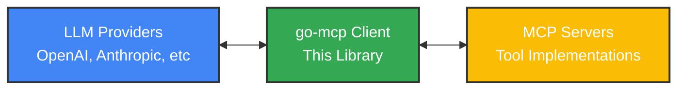
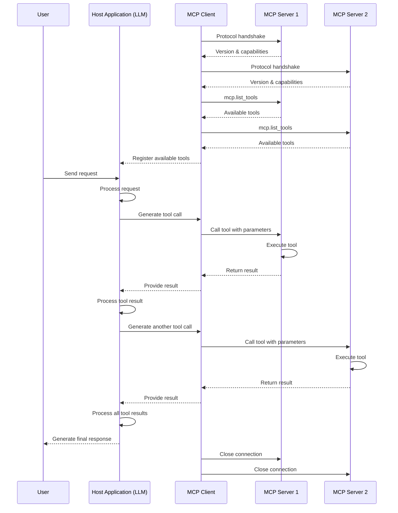

# go-mcp

A powerful, flexible Go implementation of the Model Context Protocol (MCP) - enabling seamless integration between LLMs and the tools they need.

## Why MCP Matters

Large Language Models (LLMs) need to interact with external tools to be truly useful. But each AI provider implements tool calling differently, creating a fragmented ecosystem.

The Model Context Protocol (MCP) solves this by providing:

- **Standardized Tool Interface**: Run the same tools across different LLM providers
- **Two-way Communication**: Let AI models access real-world capabilities through a uniform API
- **Reduced Integration Complexity**: Write tools once, use them with any MCP-compatible AI

This Go implementation makes it easy to connect your Go applications with AI tools, regardless of which LLM provider you're using.

## Architecture

The MCP architecture creates a standardized bridge between LLMs and tool implementations:



## Key Features

- **Simplified Tool Integration**: Connect to MCP tool servers with minimal code
- **Provider Agnostic**: Works with multiple LLM providers 
- **Server Management**: Launch, monitor, and shut down tool servers
- **Transport Flexibility**: Connect via stdio, HTTP, WebSockets, and more
- **Tool Discovery**: Automatically find and use available tools
- **Schema Validation**: Ensure data consistency through JSON Schema validation

## Quick Start

```go
package main

import (
	"context"
	"fmt"
	"log"
	"time"

	"github.com/user/go-mcp/pkg/mcp/protocol"
)

func main() {
	// Create a client and connect to an MCP server
	client := protocol.NewClient(protocol.ClientInfo{Name: "go-mcp-example", Version: "1.0.0"})
	transport := protocol.NewStdioTransport("python path/to/mcp_server.py")
	
	if err := client.Connect(transport); err != nil {
		log.Fatalf("Connection failed: %v", err)
	}
	defer client.Disconnect()
	
	// Discover available tools
	ctx := context.Background()
	tools, err := client.ListTools(ctx)
	if err != nil {
		log.Fatalf("Tool discovery failed: %v", err)
	}
	
	for _, tool := range tools {
		fmt.Printf("Found tool: %s - %s\n", tool.Name, tool.Description)
	}
	
	// Call a tool
	result, err := client.CallTool(ctx, "search", map[string]interface{}{
		"query": "climate change solutions",
		"limit": 5,
	})
	
	if err != nil {
		log.Fatalf("Tool execution failed: %v", err)
	}
	
	fmt.Printf("Results: %v\n", result)
}
```

## MCP Protocol Flow

The protocol follows a standard sequence for tool discovery and execution:



The protocol enables multi-step, agentic workflows where:
1. The LLM processes user inputs and determines which tools to use
2. Tools are executed via MCP servers and results returned to the LLM
3. The LLM can use multiple tools in sequence to complete complex tasks
4. Each tool interaction follows the same standardized messaging pattern

## Installation

```bash
go get github.com/dhruvshrma/go-mcp
```

## License

This project is licensed under the MIT License - see the LICENSE file for details.